# Tienda Dona Luz

Aplicacion para la gestion integral de una tienda de barrio.

**Desarrollado por Gonxoft Desarrolladores**

## Funcionalidades

- Gestion de clientes
- Catalogo y carrito de compras
- Gestion de pedidos
- Gestion de domiciliarios
- Direcciones y ubicacion
- Ventas y reportes
- Firebase Authentication y Cloud Firestore
- Seguimiento de pedidos

## Tecnologias

- Flutter
- Dart
- Firebase Authentication
- Cloud Firestore
- Geolocator

## Arquitectura

`	ext
lib/
├── data/
├── models/
├── screens/
├── services/
├── firebase_options.dart
└── main.dart
`

## Flujo general

Cliente -> Catalogo -> Carrito -> Confirmacion -> Tienda -> Preparacion -> Domiciliario -> Entregado

## Estado del proyecto

Proyecto funcional desarrollado en Flutter y conectado con Firebase.

## Ejecucion

`ash
flutter pub get
flutter run
`

## Capturas de la aplicacion

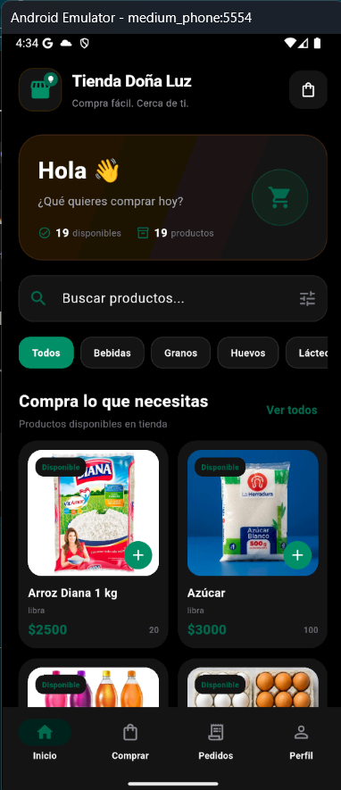
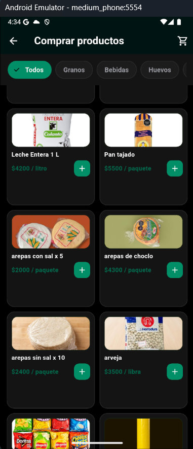
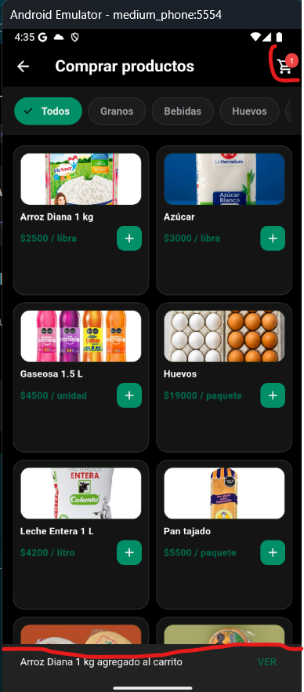
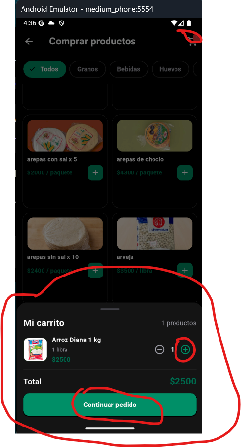
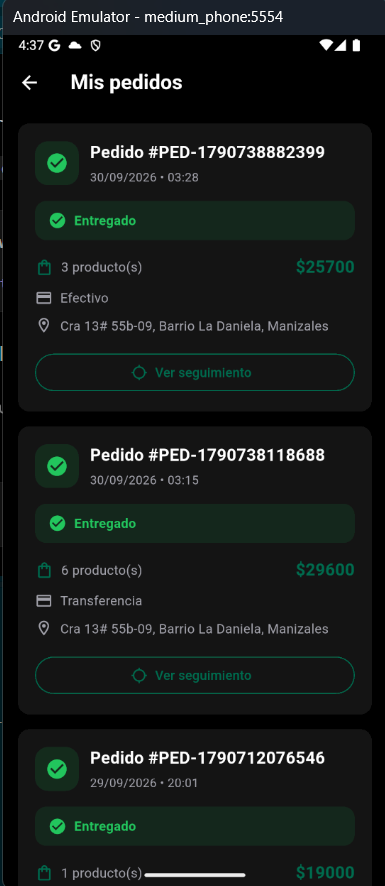
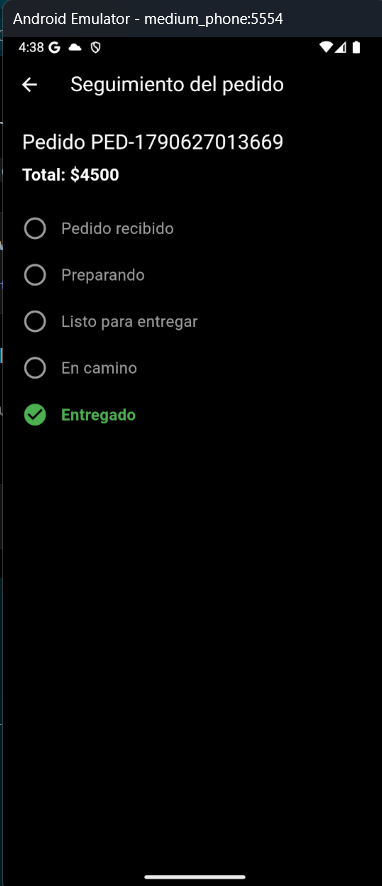
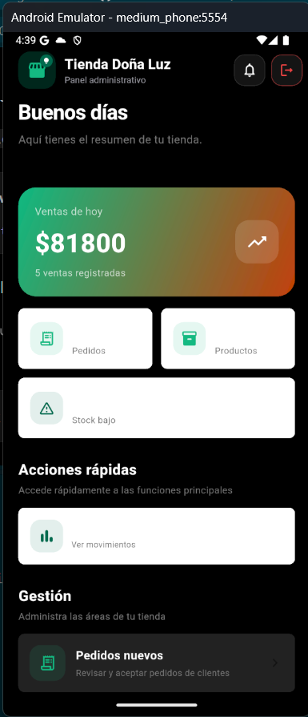
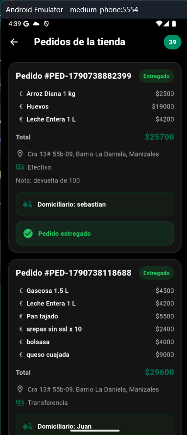
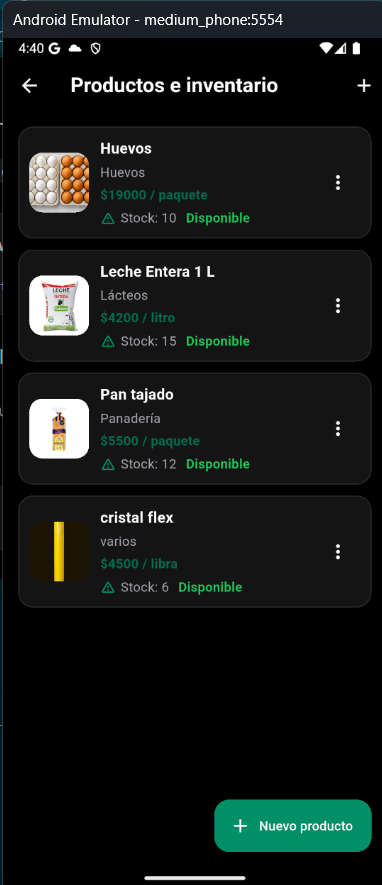
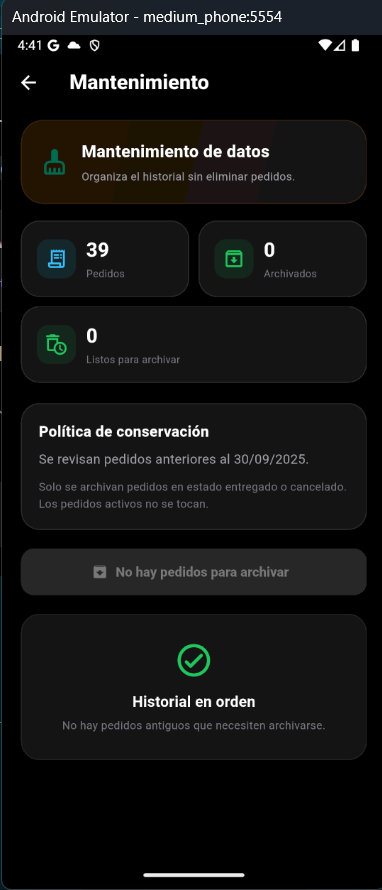
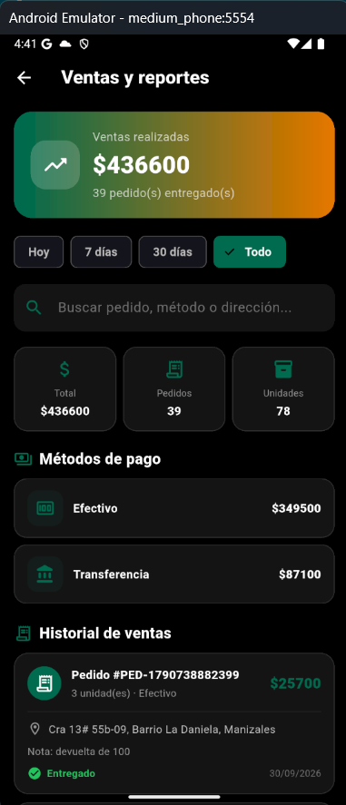
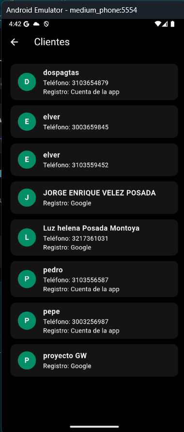
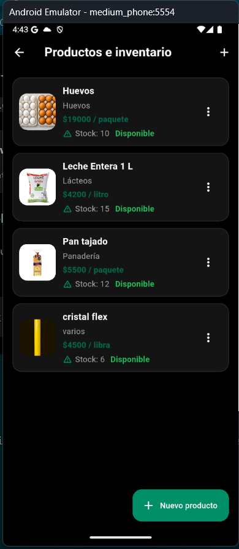